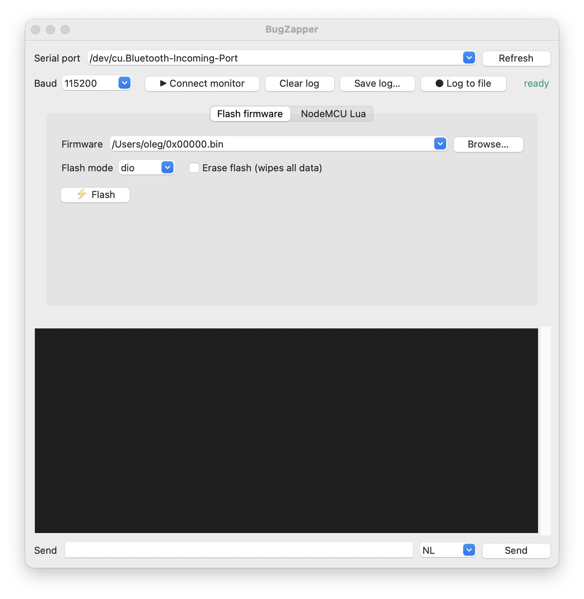
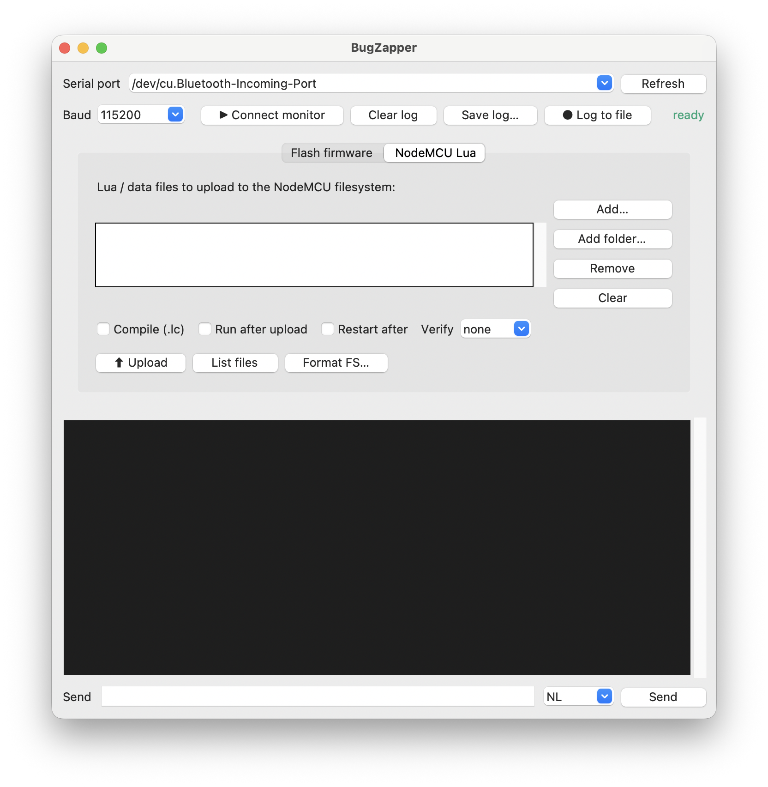

# ⚡ BugZapper

A tiny, dependency-light flasher for **ESP8266 / ESP8285 / ESP32** boards — a
GUI **and** a CLI, on **Windows, macOS and Linux** — that flashes firmware *and*
shows the serial output in one place, so you don't need separate
[NodeMCU PyFlasher](https://github.com/marcelstoer/nodemcu-pyflasher)
+ [CoolTerm](https://freeware.the-meiers.org/) windows.

- **No install needed** — pure-python `esptool` + `pyserial` are bundled in
  [`vendor/`](vendor); only `python3` is required (plus Tk for the GUI). A
  system `esptool` is used instead if one is on `PATH`.
- **Cross-platform** — port detection and the serial monitor use the bundled
  `pyserial`, so the same code runs on Windows (`COMx`), macOS and Linux.
- **GUI (`bugzapper.sh` / `bugzapper.bat`)** — pick port / firmware / baud /
  flash mode / erase, flash, and a built-in serial monitor (line-numbered log,
  ANSI colors, live baud switching, send-to-serial, save / live-log to file).
  After a flash it
  reopens the monitor to show the boot log — so no "port busy" clash. **Chip
  info** probes the connected board (chip type, MAC, flash size — handy before
  choosing an image). **Cancel**
  aborts a flash, chip probe or NodeMCU operation while it's still safe (e.g.
  stuck at "Connecting…" on the wrong port); it locks out the moment writing
  starts — a flash locks at chip detection, an upload at file transfer — so you
  can't corrupt anything mid-write.
- **NodeMCU Lua tab** (optional) — for boards running NodeMCU-Lua firmware,
  upload `init.lua` & data files into the device filesystem (compile, run, or
  restart after), list files, or format the filesystem. Uses the bundled
  [`nodemcu-uploader`](https://github.com/kmpm/nodemcu-uploader) — no install.
- **ESP32 multi-part images** — a normal ESP32 build is several files at
  different offsets (bootloader `0x1000`, partition table `0x8000`, app
  `0x10000`). In the GUI these live behind the **ESP32 / advanced** disclosure
  (collapsed by default — flashing an ESP8266 never shows an offset): queue
  parts with Offset → "+ Add part", or **Scan…** to auto-fill from a build
  folder. On the CLI, repeat `-f OFFSET:FILE`. Either way they're flashed in
  one esptool call; single-file (merged/factory) images still just flash at
  `0x0`, and the collapsed toggle summarizes any hidden offset/parts so they
  can't silently change a flash.
- **CLI (`flash.py`, or `flash.sh` on Unix)** — the same flashing as a one-liner;
  version-robust across esptool 4.x/5.x.
- **Drop-in** — auto-detects `./firmware/*.bin`; customize via env vars (below).

## Screenshots

| Flash firmware + serial monitor | NodeMCU Lua upload |
|---|---|
|  |  |

## Use it

```sh
# GUI
./bugzapper.sh                 # macOS / Linux — lists ./firmware/*.bin
./bugzapper.sh path/to/bins    # or point it at a firmware folder
bugzapper.bat                  # Windows (same args / env vars)

# CLI (cross-platform)
python3 flash.py               # flash the first ./firmware/*.bin to the auto-found port
python3 flash.py -f build/app.bin -e   # specific file, erase first
python3 flash.py -p COM5 -b 460800     # explicit port (COMx on Windows) + baud
python3 flash.py -f 0x1000:boot.bin -f 0x8000:partitions.bin -f 0x10000:app.bin
                               # ESP32 multi-part image (repeat -f with offsets)
python3 flash.py --scan build/ # ESP32: scan a build folder and flash its parts
python3 flash.py -i            # chip info: type, MAC, flash size
python3 flash.py -h            # all options
./flash.sh                     # macOS / Linux bash twin (has -i; no --scan)
```

Requirements: `python3` on any of Windows / macOS / Linux. For the GUI you also
need Tk — it ships with the python.org Windows/macOS installers; on Linux or
Homebrew install it (`apt install python3-tk`, or `brew install python-tk@3.13`).

### macOS: a double-clickable app

```sh
./make_app.sh                  # builds dist/BugZapper.app
```

The bundle carries its own copy of the flasher + `vendor/`, so drag it to
/Applications or the Dock and launch from Finder — with a real BugZapper Dock
icon instead of the Python rocket (script-launched Tk apps can't change that).
It still uses a system `python3` with Tk at runtime; nothing is compiled and
no pip install is needed. Built locally it opens on double-click; if you give
the app to someone else it's unsigned, so their first launch is right-click →
Open. For a signed or fully self-contained bundle (Python included), reach for
PyInstaller instead.

## Customize (no code edits)

| Env var | What | Default |
|---|---|---|
| `BUGZAPPER_TITLE` | GUI window title | `BugZapper` |
| `BUGZAPPER_ICON`  | path to a PNG window icon | `./icon.png` |
| `BUGZAPPER_FW_DIR`| folder of `.bin` files | `./firmware`, else cwd |
| `BUGZAPPER_SETTINGS`| where remembered GUI settings are stored | `~/.config/bugzapper/settings.json` (`%APPDATA%\bugzapper\` on Windows) |

The GUI remembers your port, baud, flash mode, line ending, verify choice and
window size between runs. Per-flash decisions (erase, offset, parts) are
deliberately **not** remembered.

## Add to your project

Copy `flashui.py`, `flash.py`, `bugzapper.sh`, `bugzapper.bat`, `flash.sh`,
`vendor/` (and optionally `icon.png`) into the repo — or add it as a **git
submodule** and call it via a thin wrapper that sets `BUGZAPPER_TITLE` /
`BUGZAPPER_ICON` for your project.

## Notes

- The bundled esptool is **2.8** (single-file, pure-python) — it speaks
  ESP8266/ESP8285 and **classic ESP32**. Newer variants (S2/S3/C3/C6…) need a
  current `esptool` on `PATH` (`pipx install esptool`); BugZapper detects and
  uses it automatically.
- A bare ESP32 `app.bin` alone won't boot — flash its bootloader / partition
  table parts too (Parts list in the GUI, repeated `-f OFFSET:FILE` on the CLI),
  or use a merged `*.factory.bin` at `0x0`.
- The serial monitor uses the bundled `pyserial` (`serial.Serial`), so it works
  the same on Windows, macOS and Linux — no `stty`/`/dev` assumptions.

## Tests

Stdlib `unittest` — no install needed. Covers vendor integrity (the bundled
tools execute, no compiled binaries), the CLI (command construction + help /
list / error paths), the GUI helpers and a Tk build smoke test, and the
pyserial read/write path via a pty loopback.

```sh
./run_tests.sh        # macOS / Linux (picks a tkinter python so GUI tests run)
run_tests.bat         # Windows
python3 -m unittest discover -s tests -p 'test_*.py' -v   # direct
```

Tests that need Tk or a serial pty skip cleanly where unavailable (e.g. headless
or Windows), so the suite is green everywhere. CI runs it on Ubuntu, macOS and
Windows ([`.github/workflows/tests.yml`](.github/workflows/tests.yml)).

## Licenses

BugZapper's own code is MIT (see [LICENSE](LICENSE)). Bundled in `vendor/`:
`esptool` (GPLv2), `pyserial` (BSD-3-Clause), and `nodemcu-uploader` (MIT),
each under its own license.
